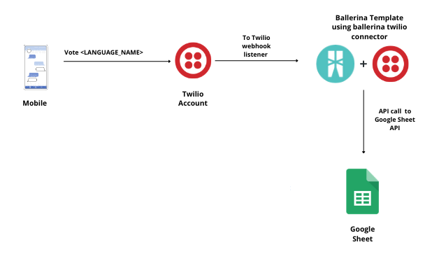
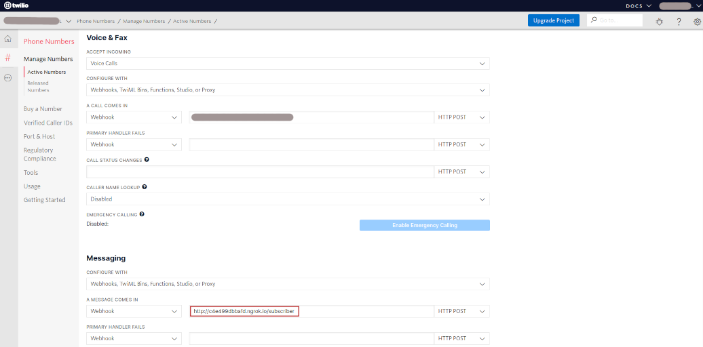
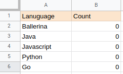

# Twilio to Google Sheet - Add data from the SMS to a Google Sheet
<div style="text-align:center"></div>

## Supported Versions
<table>
  <tr>
   <td>Ballerina Language Version
   </td>
   <td>Swan Lake Alpha2
   </td>
  </tr>
  <tr>
   <td>Java Development Kit (JDK)
   </td>
   <td>11
   </td>
  </tr>
  <tr>
   <td>Twilio REST API Version
   </td>
   <td>2010-04-01
   </td>
  </tr>
  <tr>
   <td>Google Sheets API Version
   </td>
   <td>V4
   </td>
  </tr>
</table>

## Integration Use Case
This integration template listens to the incoming sms (with a predefined template) and increment a count in a Google 
Sheet. The practical use case we have implemented here is a scenario where a survey to find out the best language for 
building micro services out of a set of given languages. The users have to sent a predefined sms in the format of 
`Vote <Language Name>` to a given Twilio number.

## Pre-requisites
* Download and install [Ballerina](https://ballerinalang.org/downloads/).
* Google Cloud Platform account
* Twilio account.

## Configuration
### Setup Twilio configuration
1. From the created Twilio account, obtain the `Account SID`.
2. For setting up a callback URL in  Twilio, you can install [ngrok](https://ngrok.com/docs) and expose a local web server to 
the internet.
3. Then start the `ngork` with `webhook:TwilioEventListener` service port (8080 in this case) by using the command `./ngrok http 8080`
4. Set the callback URL in Twilio account according to the given format. 
```
<public_url_obtained_by_ngrok>/<name_of_websub_service>
```
<div></div>

5. Use the above obtained values to set twilio_authToken and twilio_callbackUrl in the 
config(Config.toml) file.

### Setup Google Sheets Configurations
Create a Google account and create a connected app by visiting [Google cloud platform APIs and Services](https://console.cloud.google.com/apis/dashboard). 

1. Click `Library` from the left side bar.
2. In the search bar enter Google Sheets.
3. Then select Google Sheets API and click Enable button.
4. Complete OAuth Consent Screen setup.
5. Click `Credential` tab from left side bar. In the displaying window click `Create Credentials` button
Select OAuth client Id.
6. Fill the required field. Add https://developers.google.com/oauthplayground to the Redirect URI field.
7. Get client ID and client secret. Put it on the config(Config.toml) file.
8. Visit https://developers.google.com/oauthplayground/ 
    Go to settings (Top right corner) -> Tick 'Use your own OAuth credentials' and insert Oauth client ID and client secret. 
    Click close.
9. Then,Complete step 1 (Select and Authorize APIs)
10. Make sure you select https://www.googleapis.com/auth/drive & https://www.googleapis.com/auth/spreadsheets Oauth scopes.
11. Click `Authorize APIs` and You will be in step 2.
12. Exchange Auth code for tokens.
13. Copy `access token` and `refresh token`. Put it on the config(Config.toml) file.

## Configuring the Integration Template

1. Create new spreadsheet.
2. Rename the sheet if you want.
3. Get the ID of the spreadsheet.  

5. Get the work sheet name.

6. Once you obtained all configurations, Create `Config.toml` in root directory.
7. Replace the necessary fields in the `Config.toml` file with your data.

### Config.toml 
### ballerinax/twilio.webhook related configurations 
twilio_authToken = "<TWILIO_AUTH_TOKEN>"
twilio_callbackUrl = "<CALLBACK_URL>"

### ballerinax/googleapis_sheet related configurations  
sheets_spreadSheetID = "<SPREADSHEET_ID>"  
sheets_workSheetName = "<WORKSHEET_NAME>"  
sheets_refreshToken = "<REFRESH_TOKEN>"  
sheets_clientId = "<CLIENT_ID>"  
sheets_clientSecret = "<CLIENT_SECRET>"  


### Snapshot of an initial spreadsheet populated with basic data and ready for recieving user votes.
<div></div>

## Running the Template
1. First you need to build the integration template and create the executable binary. Run the following command from the 
root directory of the integration template. 
`$ bal build`. 

2. Then you can run the integration binary with the following command. 
`$  bal run target/bin/twilio_to_gsheet-0.1.1.jar`. 

3. Now you can send new messages in the format `Vote <LANGUAGE_NAME>` to the specific Twilio account and observe that integration template runtime has received the event notification upon receiving new message.

4. You can check the Google Sheet to verify that how the count of each language is increased in the specified sheet. 